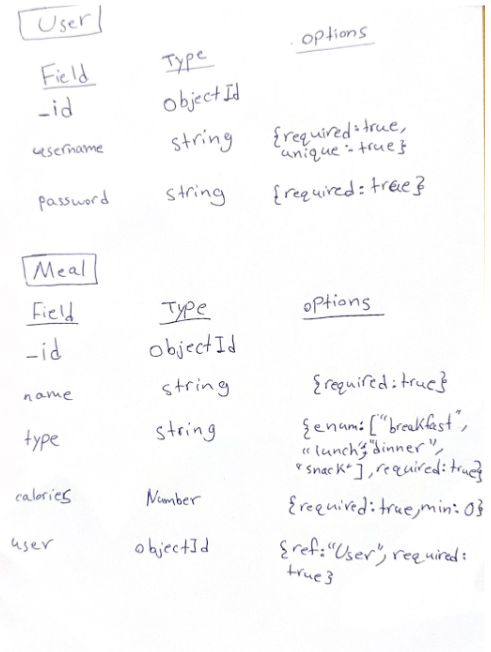
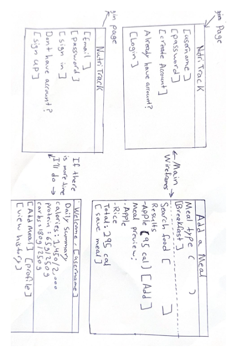
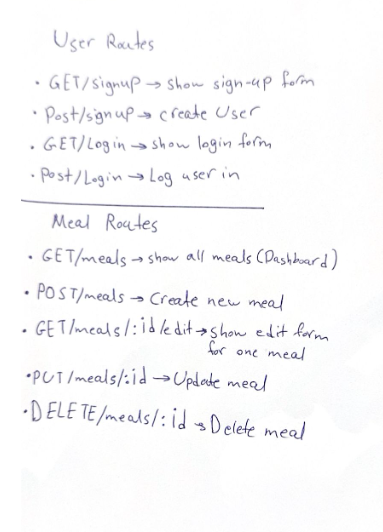
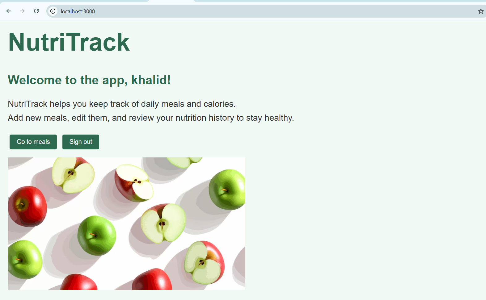

# NutriTrack-Application-Project

As a user, I want to sign up and log in so that I can have a secure account to store my nutrition data.
As a user, I want to create meals with a name, type (breakfast, lunch, dinner, snack), and calories so that I can track what I eat every day.
As a user, I want to view all my meals so that I can see what I have eaten and my daily calorie total.
As a user, I want to update my meals so that I can fix mistakes or adjust calorie information.
As a user, I want to delete meals so that I can remove incorrect or unwanted entries from my record.

NutriTrack is a meal and calorie tracking web application that allows users to log, edit, and manage their daily meals while reviewing their nutrition history. I created NutriTrack as a practical project to combine what I've learned about full-stack development, Especially focusing on CRUD functionality. The idea behind the app is to make it easier for people to stay mindful of their eating habits and promote healthier lifestyles.

My App Link:http://localhost:3000/meals

Attributions:https://img.freepik.com/premium-vector/fresh-green-red-apple-slices-white-background-healthy-eating-concept_1323048-102468.jpg

Technologies Used: -CSS -Javascript -Html

Next steps: Actually if I have more time to develop in this project, I will improve the designing (style.css), i will put more pictures so the application looks better.
